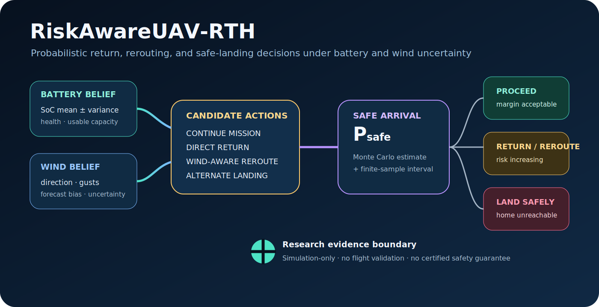
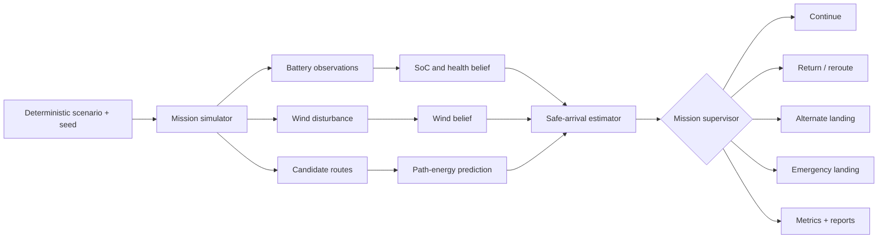

<div align="center">

# RiskAwareUAV-RTH

### Probabilistic mission management for UAVs under battery and wind uncertainty

[](https://www.python.org/)
[](.github/workflows/research-ci.yml)
[](LICENSE)
[](#evidence-boundary)

**When should an autonomous UAV continue, return, reroute, hold, or land safely when energy and weather are uncertain?**



[Research question](#research-question) · [Method](#probabilistic-method) · [Run](#reproduce) · [Evaluation](#evaluation) · [Status](#implementation-status) · [Roadmap](#research-roadmap)

</div>

---

## At a glance

| Dimension | Current repository evidence |
|---|---|
| **Battery belief** | Gaussian SoC estimator with uncertainty propagation |
| **Energy demand** | Multirotor-inspired power decomposition and 2.5D path integration |
| **Wind** | Constant, stochastic, and gust disturbances in simulation |
| **Risk** | Monte Carlo safe-arrival probability with finite-sample interval |
| **Policies** | Threshold, distance, deterministic margin, and probabilistic return baselines |
| **Validation** | Deterministic synthetic experiments, tests, configs, and generated reports |
| **Boundary** | Simulation-only; no flight validation or certified safety claim |

## Research question

> **How should an autonomous UAV decide whether to continue a mission, return home, modify its route, or land at an alternate site when battery state, battery health, wind, energy consumption, and future disturbances are uncertain?**

Fixed battery-percentage triggers ignore distance to safety, wind direction, usable-capacity degradation, route-dependent energy demand, and the possibility that home is no longer the safest reachable destination. This repository studies return-to-home as a **belief-aware sequential decision problem**, not a single threshold.

## Probabilistic method

The latent mission state contains position, velocity, altitude, battery state, battery health, and local wind:

```math
x_t = \left(p_t, v_t, h_t, SoC_t, q_t, w_t\right).
```

The estimator maintains a belief over uncertain energy and environment quantities:

```math
b_t = p\left(SoC_t, q_t, C_{usable}, w_t \mid z_{0:t}, u_{0:t-1}\right).
```

For a candidate route \(\pi\), safe arrival is the event

```math
E_{required}(\pi,w,\theta_E) + E_{reserve}
\leq E_{available}(SoC,q,C_{usable}).
```

The Monte Carlo estimator approximates

```math
\widehat P_{safe}(\pi)=\frac{1}{N}\sum_{i=1}^{N}
\mathbf{1}\left[E^{(i)}_{required}+E_{reserve}\leq E^{(i)}_{available}\right].
```

Its finite-sample interval measures uncertainty in the Monte Carlo estimate; it does **not** certify that the underlying battery, wind, or energy model is correct.

## Closed-loop research architecture



## Implemented research components

### Battery-state estimation

`risk_rth/estimation/battery_state.py` provides a transparent Gaussian/Kalman-style SoC estimator with posterior mean and variance, process uncertainty, discharge-rate uncertainty, usable-capacity uncertainty, battery-health representation, and deterministic synthetic observations.

This is not an electrochemical battery model and has not been identified from real flight data.

### Multirotor-inspired energy prediction

The expected electrical demand is decomposed into induced, profile, parasitic, vertical, avionics, efficiency, payload, and model-safety-factor terms:

```math
P = \frac{s_f}{\eta_b}
\left(P_{induced}+P_{profile}+P_{parasitic}+P_{vertical}+P_{avionics}\right).
```

The path-energy layer integrates piecewise 2.5D segments and reports distance, travel time, expected energy, uncertainty, and component-level contributions.

### Wind and disturbances

The simulator supports constant wind, Gaussian uncertainty, and sinusoidal gusts. Spatial-temporal wind fields, online wind-belief updates, wind corridors, forecast bias, and altitude-dependent wind remain research targets.

### Policies and baselines

The controlled baseline suite includes:

- fixed battery threshold;
- distance-based return;
- deterministic energy-margin return;
- Monte Carlo risk-aware return;
- oracle analysis only as a future-information upper bound.

The long-term action space is `CONTINUE`, `REDUCE SPEED`, `HOLD`, `DIRECT RETURN`, `WIND-AWARE REROUTE`, `ALTERNATE LANDING`, and `EMERGENCY LANDING`.

## Reproduce

Python 3.10 or newer is required.

```bash
python -m venv .venv
source .venv/bin/activate
python -m pip install --upgrade pip
python -m pip install -e '.[dev]'
```

Verify the research software:

```bash
ruff check .
black --check .
pytest -q
```

Run one controlled experiment:

```bash
python scripts/run_experiment.py \
  --config configs/experiments/nominal.yaml \
  --output-dir results/verification/nominal
```

Run the controlled suite and generate the demonstration media:

```bash
python scripts/run_all_experiments.py \
  --output-dir results/verification/suite
python scripts/make_demo_gif.py
```

A result is not evidence unless its exact configuration, seed, command, software environment, Git revision, and output path are preserved.

## Evaluation

A rigorous policy comparison should use identical scenarios and random seeds, multiple independent repetitions, explicit failed-run reporting, calibration analysis, subsystem ablations, and failure-case inspection.

| Category | Measures |
|---|---|
| **Mission outcome** | completion, return home, alternate landing, emergency landing |
| **Energy safety** | battery depletion, reserve violation, remaining energy |
| **Efficiency** | mission progress, path length, early-return rate |
| **Decision quality** | switches, latency, warning lead time, false alarms, missed failures |
| **Probability quality** | Brier score, reliability curve, ECE, confidence intervals |
| **Robustness** | degradation across battery health, wind, payload, route, and model mismatch |

Aggregate reports should include run count, failed runs, mean, standard deviation, median, interquartile range, extrema, and justified confidence intervals.

## Implementation status

| Subsystem | Status | Interpretation |
|---|---:|---|
| Controlled mission simulator | **Implemented** | Synthetic outbound and RTH experiments |
| Gaussian battery SoC estimator | **Research prototype** | No electrochemical validation |
| Battery-health uncertainty | **Research prototype** | Repeated-mission identification pending |
| Constant, stochastic, and gust wind | **Implemented — simulation** | Controlled disturbances |
| Multirotor-inspired power model | **Research prototype** | Generic, not platform identified |
| 2.5D path-energy integration | **Research prototype** | Segment-wise energy and uncertainty |
| Monte Carlo safe-return estimation | **Implemented** | Includes finite-sample interval |
| Threshold and deterministic baselines | **Implemented** | Controlled comparators |
| Sequential multi-action policy | **Planned** | Full closed-loop decision process pending |
| Spatial wind belief | **Planned** | Needed for wind-aware route hypotheses |
| Probability calibration | **Planned** | Reliability and threshold diagnostics |
| ROS 2 / PX4 / Gazebo bridge | **Prototype / pending validation** | No flight evidence |
| Real-flight validation | **Required** | Mandatory before operational interpretation |
| Formal safety guarantee | **Not implemented** | Simulation probability is not certification |

## Reproducibility contract

Every research run should preserve:

```text
configuration · seed · Python and package versions · operating system
Git commit · timestamp · command · runtime · output paths · summary metrics
```

> **No numerical performance claim without an executable configuration and generated evidence.**

Generated data belong under `results/`. Public-facing figures belong under `assets/` only when their source and generation path are documented.

## Evidence boundary

This repository is a **simulation-only research platform**.

It does not claim:

- electrochemical battery fidelity;
- platform-identified aerodynamics;
- calibrated real-world safe-arrival probabilities;
- certified chance constraints;
- formal safety guarantees;
- hardware-in-the-loop or real-flight validation;
- flight or regulatory readiness.

Deployment on a physical aircraft requires platform identification, hardware-in-the-loop testing, independent validation, fault handling, operational risk assessment, regulatory compliance, and real-flight evidence.

## Research roadmap

1. Integrate battery belief into every simulator decision step.
2. Implement spatial-temporal wind fields and online wind-belief updates.
3. Compare direct, minimum-energy, wind-aware, and risk-aware return routes.
4. Implement sequential multi-action decision-making.
5. Separate policy utility from an independent safety supervisor.
6. Evaluate alternate landing sites when home is unsafe.
7. Add chance-constraint and probability-calibration experiments.
8. Run identical-seed baseline, ablation, and sensitivity studies.
9. Validate ROS 2/PX4/Gazebo integration before hardware experiments.

## Documentation

Detailed scientific assumptions and protocols are available in [`docs/`](docs/), including the mathematical formulation, battery and wind models, multirotor energy model, Monte Carlo estimator, evaluation protocol, experiments, reproducibility contract, and roadmap.

## Citation and license

Citation metadata is provided in [`CITATION.cff`](CITATION.cff). Released under the [MIT License](LICENSE).

---

<div align="center">

**RiskAwareUAV-RTH studies when returning home is safe—and when home is no longer the safest option.**

</div>